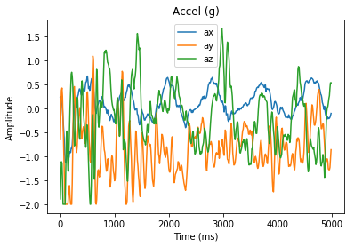

# Premier notebook Python avec l'IMU
Ce document présente les différentes cellules du script utilisé pour tester le module. Le code source est présent dans le fichier IMUJupyterPython.ipynb. Il est possible de l'importer dans le notebook. L'IMU était cadencé à 100Hz.
```python
# Création et paramétrage du port série
import serial
ser = serial.Serial()
ser.baudrate = 115200 
ser.port = 'COM3' # Ou '/dev/tty.usbmodem1411' par exemple, sous MacOS
ser
```

La sortie donne les paramètres de configuration du port :


    Serial<id=0xa3b5470, open=False>(port='COM3', baudrate=115200, bytesize=8, parity='N', stopbits=1, timeout=None, xonxoff=False, rtscts=False, dsrdtr=False)


```python
# Ouverture connection au port série
ser.open()
ser.is_open
```

Tout va bien, le port série est ouvert :-) :


    True

500 échantillons des neuf canaux à 100Hz, c.a.d. cinq secondes de données : 

```python
# Lecture et accumulation de 500 frames de données (temps, ax, ay, az, gx, gy, gz, mx, my, mz)
lines = []
for i in range(0,500):
    line = ser.readline()
    line = line.rstrip()
    lines.append(line)
print('Première ligne : ' + lines[0].decode('UTF8'))
# Fermeture connection port série dans la foulée
ser.flush()
ser.close()
ser.is_open
```
Chaque ligne de données à la forme suivante :

    b'55932, 0.88, -0.05, -0.52, -1.95, 1.28, -3.17, 57.16, -64.07, -52.36'
    
C'est une suite d'octets, même si cela ressemble à une chaine de caractères : le charactère b en tête spécifie que c'est une série d'octets.

Le port série est maintenant fermé, normal :


    False


Analyse des données accumulées :

```python
# Décodage des 500 frames
time0 = lines[0].decode('UTF8').split(',')[0]
times = []; axs = []; ays = []; azs = []; gxs = []; gys = []; gzs = []; mxs = []; mys = []; mzs = [];
for row in lines:
    time, ax, ay, az, gx, gy, gz, mx, my, mz = row.decode('UTF-8').split(',')
    times.append(int(time) - int(time0));
    axs.append(float(ax)); ays.append(float(ay)); azs.append(float(az));
    gxs.append(float(gx)); gys.append(float(gy)); gzs.append(float(gz));
    mxs.append(float(mx)); mys.append(float(my)); mzs.append(float(mz));
```
On remarque l'utilisation de la méthode *decode('UTF8')* pour transformer le flux d'octets en chaine de caractères.
Affichage dans trois graphes (accel, gyro, magneto) :

```python
# Affichage des accélérations
import matplotlib.pyplot as plt
plt.figure(1)
plt.title('Accel (g)')
plt.xlabel('Time (ms)')
plt.ylabel('Amplitude')
plt.plot(times, axs, label = 'ax')
plt.plot(times, ays, label = 'ay')
plt.plot(times, azs, label = 'az')
plt.legend()
plt.show()
```





```python
# Affichage des gyros
plt.figure(2)
plt.title('Giro (°/s)')
plt.xlabel('Time')
plt.ylabel('Amplitude')
plt.plot(times, gxs, label = 'gx')
plt.plot(times, gys, label = 'gy')
plt.plot(times, gzs, label = 'gz')
plt.legend()
plt.show()
```


```python
# Affichage des magnétos
plt.figure(3)
plt.title('Mag (uT)')
plt.xlabel('Time')
plt.ylabel('Amplitude')
plt.plot(times, mxs, label = 'mx')
plt.plot(times, mys, label = 'my')
plt.plot(times, mzs, label = 'mz')
plt.legend()
plt.show()
```


